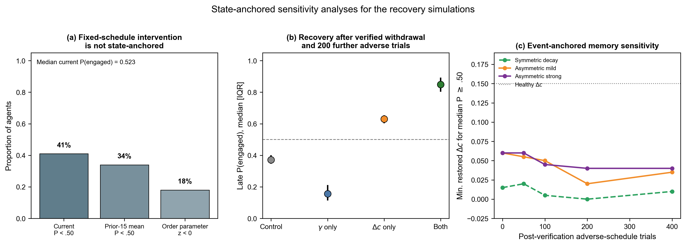
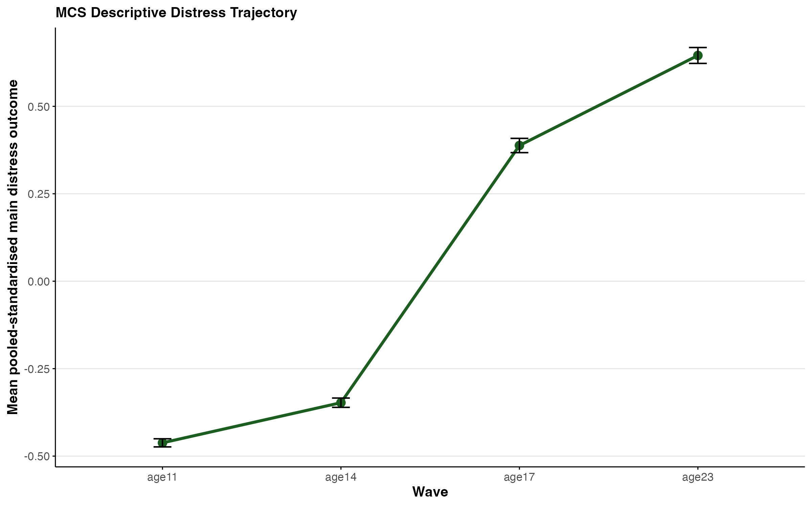
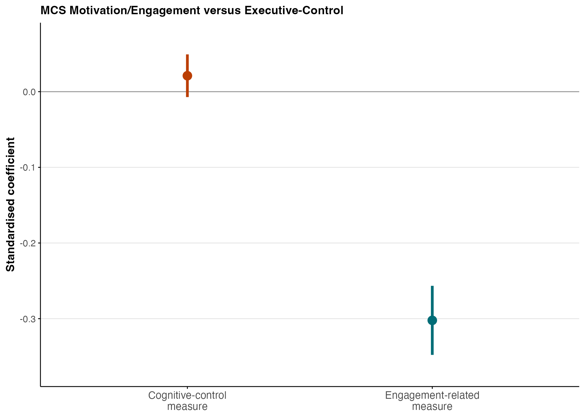
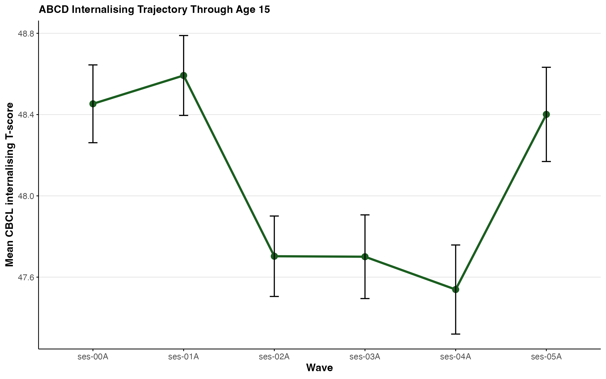
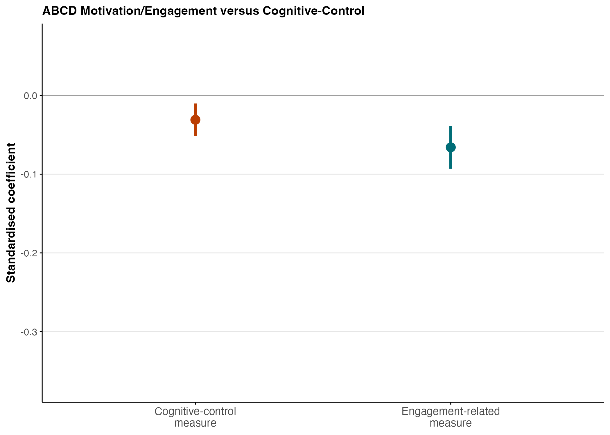

```{r setup, include=FALSE}
knitr::opts_chunk$set(
  echo = FALSE,
  warning = FALSE,
  message = FALSE,
  fig.align = "center",
  fig.width = 8,
  fig.height = 5,
  dpi = 300,
  out.width = "92%"
)

library(dplyr)
library(glue)
library(knitr)
library(kableExtra)
library(readr)
library(scales)
library(stringr)
library(tidyr)
library(ggplot2)
library(purrr)

required_outputs <- c(
  "outputs/tables/claim_summary.csv",
  "outputs/tables/abcd_wave_summary.csv",
  "outputs/tables/mcs_wave_summary.csv",
  "outputs/tables/abcd_attrition.csv",
  "outputs/tables/mcs_attrition.csv",
  "outputs/tables/abcd_model_metrics.csv",
  "outputs/tables/mcs_model_metrics.csv",
  "outputs/tables/abcd_model_coefficients.csv",
  "outputs/tables/mcs_model_coefficients.csv",
  "outputs/tables/abcd_coefficient_tests.csv",
  "outputs/tables/mcs_coefficient_tests.csv",
  "outputs/tables/abcd_primary_demographics.csv",
  "outputs/tables/mcs_primary_demographics.csv",
  "outputs/tables/abcd_context_full.csv",
  "outputs/tables/abcd_sensitivity_full.csv",
  "outputs/tables/abcd_primary_fiml_coefficients.csv",
  "outputs/tables/abcd_primary_fiml_test.csv",
  "outputs/tables/abcd_no_parented_coefficients.csv",
  "outputs/tables/abcd_no_parented_test.csv",
  "outputs/tables/abcd_context_moderation.csv",
  "outputs/tables/mcs_context_moderation.csv",
  "outputs/tables/mcs_prs_moderation.csv",
  "outputs/tables/mcs_context_full.csv",
  "outputs/tables/mcs_prs_full.csv",
  "outputs/tables/mcs_sensitivity_full.csv",
  "outputs/tables/mcs_primary_mi_coefficients.csv",
  "outputs/tables/mcs_primary_mi_test.csv",
  "outputs/tables/abcd_sensitivity_coefficients.csv",
  "outputs/tables/abcd_sensitivity_tests.csv",
  "outputs/tables/mcs_sensitivity_coefficients.csv",
  "outputs/tables/mcs_sensitivity_tests.csv",
  "outputs/tables/mcs_precision_proxy_sensitivity.csv",
  "outputs/tables/abcd_precision_proxy_sensitivity.csv",
  "outputs/tables/mcs_composite_reliability.csv",
  "outputs/tables/abcd_composite_reliability.csv",
  "outputs/tables/mcs_balance_descriptives.csv",
  "outputs/tables/mcs_balance_comparison.csv",
  "outputs/tables/mcs_balance_aic.csv",
  "outputs/tables/abcd_balance_descriptives.csv",
  "outputs/tables/abcd_balance_comparison.csv",
  "outputs/tables/abcd_balance_aic.csv",
  "outputs/tables/fixed_schedule_intervention_state.csv",
  "outputs/tables/verified_withdrawal_field_summary.csv",
  "outputs/tables/verified_withdrawal_diagnostics.csv",
  "outputs/tables/verified_withdrawal_memory_summary.csv",
  "outputs/tables/verified_withdrawal_threshold_summary.csv",
  "outputs/inventory/abcd_variable_mapping.csv",
  "outputs/inventory/mcs_variable_mapping.csv",
  "outputs/figures/mcs_trajectory.png",
  "outputs/figures/mcs_field_vs_precision.png",
  "outputs/figures/abcd_trajectory.png",
  "outputs/figures/abcd_field_vs_precision.png",
  "Python_code/Figs_psychopathology/fig_S6_verified_withdrawal.png"
)

if (!all(file.exists(required_outputs))) {
  missing_outputs <- required_outputs[!file.exists(required_outputs)]
  stop(
    "The aggregate release outputs required to render this SOM are missing:\n",
    paste0("- ", missing_outputs, collapse = "\n"),
    "\nRun the licensed-data pipeline in an authorised environment before rendering."
  )
}

project_config <- yaml::read_yaml("config/project_config.yml")
abcd_baseline_session <- project_config$analysis$abcd_baseline_session
abcd_followup_session <- project_config$analysis$abcd_followup_session

abcd_wave <- read_csv("outputs/tables/abcd_wave_summary.csv", show_col_types = FALSE)
mcs_wave <- read_csv("outputs/tables/mcs_wave_summary.csv", show_col_types = FALSE)
abcd_attrition <- read_csv("outputs/tables/abcd_attrition.csv", show_col_types = FALSE)
mcs_attrition <- read_csv("outputs/tables/mcs_attrition.csv", show_col_types = FALSE)
abcd_metrics <- read_csv("outputs/tables/abcd_model_metrics.csv", show_col_types = FALSE)
mcs_metrics <- read_csv("outputs/tables/mcs_model_metrics.csv", show_col_types = FALSE)
abcd_coefs <- read_csv("outputs/tables/abcd_model_coefficients.csv", show_col_types = FALSE)
mcs_coefs <- read_csv("outputs/tables/mcs_model_coefficients.csv", show_col_types = FALSE)
abcd_tests <- read_csv("outputs/tables/abcd_coefficient_tests.csv", show_col_types = FALSE)
mcs_tests <- read_csv("outputs/tables/mcs_coefficient_tests.csv", show_col_types = FALSE)
abcd_primary_demographics <- read_csv("outputs/tables/abcd_primary_demographics.csv", show_col_types = FALSE)
mcs_primary_demographics <- read_csv("outputs/tables/mcs_primary_demographics.csv", show_col_types = FALSE)
abcd_fiml_coefs <- read_csv("outputs/tables/abcd_primary_fiml_coefficients.csv", show_col_types = FALSE)
abcd_fiml_test <- read_csv("outputs/tables/abcd_primary_fiml_test.csv", show_col_types = FALSE)
mcs_mi_coefs <- read_csv("outputs/tables/mcs_primary_mi_coefficients.csv", show_col_types = FALSE)
mcs_mi_test <- read_csv("outputs/tables/mcs_primary_mi_test.csv", show_col_types = FALSE)
abcd_sensitivity_coefs <- read_csv("outputs/tables/abcd_sensitivity_coefficients.csv", show_col_types = FALSE)
abcd_sensitivity_tests <- read_csv("outputs/tables/abcd_sensitivity_tests.csv", show_col_types = FALSE)
abcd_context <- read_csv("outputs/tables/abcd_context_moderation.csv", show_col_types = FALSE)
abcd_context_full <- read_csv("outputs/tables/abcd_context_full.csv", show_col_types = FALSE)
abcd_sensitivity_full <- read_csv("outputs/tables/abcd_sensitivity_full.csv", show_col_types = FALSE)
mcs_context <- read_csv("outputs/tables/mcs_context_moderation.csv", show_col_types = FALSE)
mcs_context_full <- read_csv("outputs/tables/mcs_context_full.csv", show_col_types = FALSE)
mcs_prs <- read_csv("outputs/tables/mcs_prs_moderation.csv", show_col_types = FALSE)
mcs_prs_full <- read_csv("outputs/tables/mcs_prs_full.csv", show_col_types = FALSE)
mcs_sensitivity_coefs <- read_csv("outputs/tables/mcs_sensitivity_coefficients.csv", show_col_types = FALSE)
mcs_sensitivity_full <- read_csv("outputs/tables/mcs_sensitivity_full.csv", show_col_types = FALSE)
mcs_sensitivity_tests <- read_csv("outputs/tables/mcs_sensitivity_tests.csv", show_col_types = FALSE)
mcs_precision_proxy_sens <- read_csv("outputs/tables/mcs_precision_proxy_sensitivity.csv", show_col_types = FALSE)
mcs_reliability <- read_csv("outputs/tables/mcs_composite_reliability.csv", show_col_types = FALSE)
mcs_balance_desc <- read_csv("outputs/tables/mcs_balance_descriptives.csv", show_col_types = FALSE)
mcs_balance_comp <- read_csv("outputs/tables/mcs_balance_comparison.csv", show_col_types = FALSE)
mcs_balance_aic <- read_csv("outputs/tables/mcs_balance_aic.csv", show_col_types = FALSE)
abcd_reliability <- read_csv("outputs/tables/abcd_composite_reliability.csv", show_col_types = FALSE)
abcd_precision_proxy_sens <- read_csv("outputs/tables/abcd_precision_proxy_sensitivity.csv", show_col_types = FALSE)
abcd_balance_desc <- read_csv("outputs/tables/abcd_balance_descriptives.csv", show_col_types = FALSE)
abcd_balance_comp <- read_csv("outputs/tables/abcd_balance_comparison.csv", show_col_types = FALSE)
abcd_balance_aic <- read_csv("outputs/tables/abcd_balance_aic.csv", show_col_types = FALSE)
claim_summary <- read_csv("outputs/tables/claim_summary.csv", show_col_types = FALSE)
abcd_mapping <- read_csv("outputs/inventory/abcd_variable_mapping.csv", show_col_types = FALSE)
mcs_mapping <- read_csv("outputs/inventory/mcs_variable_mapping.csv", show_col_types = FALSE)

simulation_outputs <- c(
  "outputs/tables/fixed_schedule_intervention_state.csv",
  "outputs/tables/verified_withdrawal_field_summary.csv",
  "outputs/tables/verified_withdrawal_diagnostics.csv",
  "outputs/tables/verified_withdrawal_memory_summary.csv",
  "outputs/tables/verified_withdrawal_threshold_summary.csv",
  "Python_code/Figs_psychopathology/fig_S6_verified_withdrawal.png"
)
if (!all(file.exists(simulation_outputs))) {
  stop("State-anchored simulation outputs are missing. Run `python3 main.py` before rendering the SOM.")
}

fixed_schedule_state <- read_csv(
  "outputs/tables/fixed_schedule_intervention_state.csv", show_col_types = FALSE
)
verified_field_summary <- read_csv(
  "outputs/tables/verified_withdrawal_field_summary.csv", show_col_types = FALSE
)
verified_withdrawal_diagnostics <- read_csv(
  "outputs/tables/verified_withdrawal_diagnostics.csv", show_col_types = FALSE
)
verified_memory_summary <- read_csv(
  "outputs/tables/verified_withdrawal_memory_summary.csv", show_col_types = FALSE
)
verified_threshold_summary <- read_csv(
  "outputs/tables/verified_withdrawal_threshold_summary.csv", show_col_types = FALSE
)

has_family_clustered_inference <- function(data) {
  "missingness_handling" %in% names(data) &&
    nrow(data) > 0 &&
    all(str_detect(coalesce(data$missingness_handling, ""), fixed("family-cluster-robust")))
}

abcd_primary_family_clustered <- all(c(
  has_family_clustered_inference(abcd_coefs),
  has_family_clustered_inference(abcd_tests),
  has_family_clustered_inference(abcd_context),
  has_family_clustered_inference(abcd_sensitivity_coefs),
  has_family_clustered_inference(abcd_sensitivity_tests),
  has_family_clustered_inference(abcd_precision_proxy_sens),
  has_family_clustered_inference(abcd_balance_comp)
))
abcd_fiml_family_clustered <- any(
  str_detect(
    coalesce(abcd_fiml_coefs$missingness_handling, ""),
    fixed("family-cluster-robust")
  )
)

main_abcd_sessions <- c("ses-00A", "ses-01A", "ses-02A", "ses-03A", "ses-04A", "ses-05A")
abcd_main_wave <- abcd_wave %>% filter(wave %in% main_abcd_sessions)

mcs_precision_label <- "Executive-control primary proxy"
abcd_precision_label <- "Cognitive-control primary proxy"
mcs_precision_model_label <- "Executive-control model"
abcd_precision_model_label <- "Cognitive-control model"
abcd_positive_affect_reliability <- abcd_reliability %>%
  filter(composite == "Positive-affect balance denominator") %>%
  slice(1)

fmt_p <- function(x) {
  case_when(
    is.na(x) ~ "",
    x < .001 ~ "< .001",
    TRUE ~ str_replace(sprintf("%.3f", x), "^0", "")
  )
}

fmt_p_relation <- function(x) {
  ifelse(x < .001, "< .001", paste0("= ", fmt_p(x)))
}

abcd_primary_contrast <- abcd_tests %>%
  filter(model == "combined") %>%
  slice(1)
abcd_fiml_contrast <- abcd_fiml_test %>%
  filter(model == "combined_fiml") %>%
  slice(1)
abcd_parent_education <- abcd_coefs %>%
  filter(model == "combined", term == "parent_education_z") %>%
  slice(1)
abcd_sleep_field_interaction <- abcd_context %>%
  filter(model == "abcd_sleep_risk", term == "field_index:sleep_risk") %>%
  slice(1)
abcd_bpm_internalising_contrast <- abcd_sensitivity_tests %>%
  filter(outcome == "Age 15 youth BPM internalising") %>%
  slice(1)
abcd_bpm_attention_contrast <- abcd_sensitivity_tests %>%
  filter(outcome == "Age 15 youth BPM attention") %>%
  slice(1)
mcs_balance_distress <- mcs_balance_comp %>%
  filter(model == "Distress only") %>%
  slice(1)
mcs_balance_index <- mcs_balance_comp %>%
  filter(model == "Balance index") %>%
  slice(1)
abcd_balance_stress <- abcd_balance_comp %>%
  filter(model == "Stress only") %>%
  slice(1)
abcd_balance_index <- abcd_balance_comp %>%
  filter(model == "Balance index") %>%
  slice(1)
abcd_primary_n <- abcd_primary_contrast$nobs[[1]]

apa_table <- function(df, caption = NULL, digits = 3) {
  df %>%
    mutate(across(where(is.numeric), ~ round(., digits))) %>%
    kbl(caption = caption, align = "l") %>%
    kable_classic(full_width = FALSE, html_font = "Arial") %>%
    kable_styling(font_size = 13)
}

scroll_apa_table <- function(df, caption = NULL, digits = 3, height = "360px") {
  apa_table(df, caption = caption, digits = digits) %>%
    scroll_box(height = height)
}

sample_flow_plot <- function(df, title, ylab) {
  ggplot(df, aes(x = wave, y = n_participants, group = 1)) +
    geom_line(color = "#264653", linewidth = 1) +
    geom_point(color = "#264653", size = 2.5) +
    geom_text(aes(label = comma(n_participants)), vjust = -0.7, size = 3.4) +
    labs(title = title, x = NULL, y = ylab) +
    theme_minimal(base_size = 12) +
    theme(
      panel.grid.minor = element_blank(),
      plot.title = element_text(face = "bold")
    )
}

pretty_component <- function(x, precision_label = mcs_precision_label) {
  recode(
    x,
    field_index = "Motivation/engagement composite",
    precision_index = precision_label,
    family_conflict = "family conflict",
    sleep_risk = "sleep-risk composite",
    peer_school_trouble = "peer-related school trouble",
    sampling_stratum = "PTTYPE2 sampling stratum",
    family_context = "family context composite",
    neighborhood_risk = "area deprivation",
    peer_adversity = "peer adversity",
    depression_prs = "depression PRS (reverse-scored)",
    mdd_prs = "MDD PRS",
    anxiety_prs = "anxiety PRS",
    adhd_prs = "ADHD PRS",
    externalising_prs = "externalising PRS",
    cognition_pgi = "cognition PGI",
    asd_pgi = "ASD PGI",
    agreeableness_pgi = "agreeableness PGI",
    conscientiousness_pgi = "conscientiousness PGI",
    extraversion_pgi = "extraversion PGI",
    neuroticism_pgi = "neuroticism PGI",
    openness_pgi = "openness PGI",
    .default = x
  )
}

pretty_outcome <- function(x) {
  recode(
    x,
    "Age 15 parent-reported internalising" = "Age 15 parent-reported internalising",
    "Age 15 youth BPM internalising" = "Age 15 youth BPM internalising",
    "Age 15 youth BPM attention" = "Age 15 youth BPM attention",
    "Age 14 MFQ depressive symptoms" = "Age 14 MFQ depressive symptoms",
    "Age 17 psychological distress" = "Age 17 psychological distress",
    "Age 17 wellbeing" = "Age 17 mental wellbeing",
    "Age 23 psychological distress" = "Age 23 psychological distress",
    "Age 23 anxiety symptoms" = "Age 23 anxiety symptoms",
    "Age 23 depressive symptoms" = "Age 23 depressive symptoms",
    "Age 23 loneliness" = "Age 23 loneliness",
    "Age 23 wellbeing" = "Age 23 mental wellbeing",
    .default = x
  )
}

pretty_term <- function(term, precision_label = mcs_precision_label) {
  map_chr(term, function(x) {
    if (!str_detect(x, ":")) {
      return(pretty_component(x, precision_label = precision_label))
    }
    parts <- str_split(x, ":", simplify = TRUE)
    paste(
      pretty_component(parts[1], precision_label = precision_label),
      "x",
      pretty_component(parts[2], precision_label = precision_label)
    )
  })
}

pretty_covariate <- function(x, precision_label = mcs_precision_label) {
  recode(
    x,
    `(Intercept)` = "Intercept",
    baseline_distress_z = "Baseline distress",
    baseline_internalising_z = "Baseline parent-reported internalising",
    baseline_bpm_internalising_z = "Baseline youth BPM internalising",
    baseline_bpm_attention_z = "Baseline youth BPM attention",
    baseline_age_z = "Baseline age",
    sex_z = "Sex",
    income_quintile_z = "OECD equivalised income quintile",
    household_income_z = "Household income",
    parent_education_z = "Parent education",
    neighborhood_risk_z = "Area deprivation",
    field_index = "Motivation/engagement composite",
    precision_index = precision_label,
    family_conflict = "Family conflict",
    sleep_risk = "Sleep-risk composite",
    peer_school_trouble = "Peer-related school trouble",
    family_context = "Family context composite",
    peer_adversity = "Peer adversity",
    depression_prs = "Depression PRS (reverse-scored)",
    mdd_prs = "MDD PRS",
    anxiety_prs = "Anxiety PRS",
    adhd_prs = "ADHD PRS",
    externalising_prs = "Externalising PRS",
    cognition_pgi = "Cognition PGI",
    asd_pgi = "ASD PGI",
    agreeableness_pgi = "Agreeableness PGI",
    conscientiousness_pgi = "Conscientiousness PGI",
    extraversion_pgi = "Extraversion PGI",
    neuroticism_pgi = "Neuroticism PGI",
    openness_pgi = "Openness PGI",
    site = "Assessment site",
    .default = x
  )
}

pretty_full_term <- function(term, precision_label = mcs_precision_label) {
  map_chr(term, function(x) {
    if (str_detect(x, "^site")) {
      return("Assessment site")
    }
    if (str_detect(x, "^sampling_stratum")) {
      return(str_replace(x, "^sampling_stratum", "PTTYPE2 stratum: "))
    }
    if (str_detect(x, "^pc[0-9]+$")) {
      return(str_replace(x, "^pc", "Ancestry PC "))
    }
    if (!str_detect(x, ":")) {
      return(pretty_covariate(x, precision_label = precision_label))
    }
    parts <- str_split(x, ":", simplify = TRUE)
    paste(
      pretty_covariate(parts[1], precision_label = precision_label),
      "x",
      pretty_covariate(parts[2], precision_label = precision_label)
    )
  })
}

pretty_model <- function(x, precision_model_label = mcs_precision_model_label) {
  recode(
    x,
    combined = "Combined model",
    combined_mi = "Combined model (MI)",
    combined_fiml = "Combined model (FIML)",
    base = "Base model",
    field = "Motivation/engagement model",
    precision = precision_model_label,
    mcs_family_conflict = "Family conflict moderation",
    mcs_sleep_risk = "Sleep moderation",
    mcs_peer_school_trouble = "Peer-school moderation",
    abcd_family_context = "Family context moderation",
    abcd_sleep_risk = "Sleep moderation",
    abcd_neighborhood_risk = "Neighborhood moderation",
    abcd_peer_adversity = "Peer adversity moderation",
    mcs_prs_depression_prs = "Depression PRS moderation",
    mcs_prs_mdd_prs = "MDD PRS moderation",
    mcs_prs_anxiety_prs = "Anxiety PRS moderation",
    mcs_prs_adhd_prs = "ADHD PRS moderation",
    mcs_prs_externalising_prs = "Externalising PRS moderation",
    mcs_prs_cognition_pgi = "Cognition PGI moderation",
    mcs_prs_asd_pgi = "ASD PGI moderation",
    mcs_prs_agreeableness_pgi = "Agreeableness PGI moderation",
    mcs_prs_conscientiousness_pgi = "Conscientiousness PGI moderation",
    mcs_prs_extraversion_pgi = "Extraversion PGI moderation",
    mcs_prs_neuroticism_pgi = "Neuroticism PGI moderation",
    mcs_prs_openness_pgi = "Openness PGI moderation",
    .default = x
  )
}

full_results_table <- function(df, model_label = NULL, height = "420px", caption = NULL, precision_label = mcs_precision_label, precision_model_label = mcs_precision_model_label) {
  out <- df
  if (!is.null(model_label) && "model" %in% names(out)) {
    out <- out %>% filter(model == model_label)
  }
  out %>%
    mutate(
      term = pretty_full_term(term, precision_label = precision_label),
      `95% CI` = if_else(
        is.na(conf_low) | is.na(conf_high),
        "",
        paste0("[", sprintf("%.3f", conf_low), ", ", sprintf("%.3f", conf_high), "]")
      ),
      p_value = vapply(p_value, fmt_p, character(1))
    ) %>%
    transmute(
      Outcome = pretty_outcome(outcome),
      Model = pretty_model(model, precision_model_label = precision_model_label),
      N = nobs,
      Missingness = missingness_handling,
      Term = term,
      B = estimate,
      `95% CI`,
      `Std. b` = if_else(is.na(std_estimate), "—", sprintf("%.3f", std_estimate)),
      Statistic = statistic,
      p = p_value
    ) %>%
    scroll_apa_table(caption = caption, height = height, digits = 3)
}

overview_variable_table <- bind_rows(
  mcs_mapping %>% mutate(cohort = "MCS"),
  abcd_mapping %>% mutate(cohort = "ABCD")
) %>%
  filter(category %in% c("outcome", "field_like", "field_sensitivity", "precision_like", "precision_sensitivity", "context", "prs")) %>%
  filter(!(cohort == "ABCD" & category == "prs")) %>%
  select(cohort, category, construct, variable, notes)

abcd_combined <- abcd_coefs %>%
  filter(model == "combined", term %in% c("field_index", "precision_index")) %>%
  mutate(
    predictor_family = recode(term, field_index = "Motivation/engagement", precision_index = abcd_precision_label),
    p_value = vapply(p_value, fmt_p, character(1))
  ) %>%
  select(predictor_family, estimate, std_error, statistic, p_value, nobs, missingness_handling)

mcs_combined <- mcs_coefs %>%
  filter(model == "combined", term %in% c("field_index", "precision_index")) %>%
  mutate(
    predictor_family = recode(term, field_index = "Motivation/engagement", precision_index = abcd_precision_label),
    p_value = vapply(p_value, fmt_p, character(1))
  ) %>%
  select(predictor_family, estimate, std_error, statistic, p_value, nobs, missingness_handling)

comparison_tests <- bind_rows(abcd_tests, mcs_tests) %>%
  mutate(
    cohort = factor(cohort, levels = c("MCS", "ABCD")),
    outcome = pretty_outcome(outcome),
    p_value = vapply(p_value, fmt_p, character(1))
  ) %>%
  select(cohort, outcome, estimate_difference, std_error, statistic, p_value, nobs, missingness_handling)

mcs_sensitivity_table <- mcs_sensitivity_coefs %>%
  filter(term %in% c("field_index", "precision_index")) %>%
  transmute(
    outcome = pretty_outcome(outcome),
    predictor_family = recode(term, field_index = "Motivation/engagement", precision_index = abcd_precision_label),
    estimate,
    std_error,
    statistic,
    p_value = vapply(p_value, fmt_p, character(1)),
    nobs,
    missingness_handling
  ) %>%
  left_join(
    mcs_sensitivity_tests %>%
      transmute(
        outcome = pretty_outcome(outcome),
        coefficient_comparison_p = vapply(p_value, fmt_p, character(1)),
        coefficient_test_n = nobs,
        coefficient_test_missingness = missingness_handling
      ),
    by = "outcome"
  )

abcd_sensitivity_table <- abcd_sensitivity_coefs %>%
  filter(term %in% c("field_index", "precision_index")) %>%
  transmute(
    outcome = pretty_outcome(outcome),
    predictor_family = recode(term, field_index = "Motivation/engagement", precision_index = abcd_precision_label),
    estimate,
    std_error,
    statistic,
    p_value = vapply(p_value, fmt_p, character(1)),
    nobs,
    missingness_handling
  ) %>%
  left_join(
    abcd_sensitivity_tests %>%
      transmute(
        outcome = pretty_outcome(outcome),
        coefficient_comparison_p = vapply(p_value, fmt_p, character(1)),
        coefficient_test_n = nobs,
        coefficient_test_missingness = missingness_handling
      ),
    by = "outcome"
  )

mcs_precision_proxy_table <- mcs_precision_proxy_sens %>%
  transmute(
    outcome = pretty_outcome(outcome),
    `Alternative precision proxy` = precision_proxy,
    `Field estimate` = field_estimate,
    `Precision estimate` = precision_estimate,
    `Coefficient-comparison p` = vapply(coefficient_test_p, fmt_p, character(1)),
    nobs,
    missingness_handling,
    status
  )

abcd_precision_proxy_table <- abcd_precision_proxy_sens %>%
  transmute(
    outcome = pretty_outcome(outcome),
    `Alternative precision proxy` = precision_proxy,
    `Field estimate` = field_estimate,
    `Precision estimate` = precision_estimate,
    `Coefficient-comparison p` = vapply(coefficient_test_p, fmt_p, character(1)),
    nobs,
    missingness_handling,
    status
  )

model_compare <- bind_rows(
  abcd_metrics %>% mutate(cohort = "ABCD"),
  mcs_metrics %>% mutate(cohort = "MCS")
) %>%
  group_by(cohort) %>%
  mutate(delta_aic = aic - min(aic, na.rm = TRUE)) %>%
  ungroup() %>%
  mutate(model = pretty_model(model)) %>%
  select(cohort, model, nobs, missingness_handling, aic, bic, delta_aic)

strobe_checklist <- tibble::tribble(
  ~Item, ~STROBE_domain, ~What_is_covered_in_this_supplement, ~Location_in_supplement,
  "1", "Title and abstract", "The supplement title identifies the material as cohort-based observational analyses supporting the main study.", "Title page and overall structure",
  "2", "Background and rationale", "The rationale for indirect developmental tests of the theory is stated explicitly.", "Research question and inferential scope",
  "3", "Objectives", "Primary and secondary objectives are listed in direct relation to the theoretical claims under evaluation.", "Hypotheses",
  "4", "Study design", "The supplement describes cohort-specific observational analyses using longitudinal descriptive, lagged, and moderation models.", "Pipeline overview",
  "5", "Setting", "The cohorts, age windows, and broad data types are summarised.", "Data sources and analytical logic",
  "6", "Participants", "Wave-specific counts, attrition tables, and sample-flow figures are shown for both cohorts; MCS analyses retain cohort member 1 only, with PRS merges restricted to first cohort members via PNUM=100.", "Sample flow sections and MCS cohort notes",
  "7", "Variables", "Outcomes, motivation/engagement predictors, executive-control predictors, context variables, genetic scores, and covariates are documented, including the restricted White-European PRS subset in MCS.", "Variable strategy and operationalisation tables",
  "8", "Data sources and measurement", "Construct derivation choices are described transparently within each cohort.", "Cohort-specific sections",
  "9", "Bias", "Indirect measurement, missingness, sparse moderators, and genetic-model limits are discussed directly, including restriction of MCS PRS analyses to the White-European CLS PGI subset.", "Inferential scope and cross-cohort limits",
  "10", "Study size", "Observed analytical sample sizes are reported rather than justified post hoc.", "Sample flow and cohort sections",
  "11", "Quantitative variables", "Composite construction and main outcome choices are described.", "Variable strategy and MCS trajectories",
  "12", "Statistical methods", "Trajectory, lagged comparison, context moderation, and genetic moderation models are described.", "Model comparison framework and cohort analyses",
  "13", "Participants flow", "Retention and wave-level counts are tabulated and plotted.", "Section 2",
  "14", "Descriptive data", "Wave-level outcome summaries and attrition are presented.", "Sections 2 to 4",
  "15", "Outcome data", "Outcome trajectory figures and descriptive tables are included for both cohorts.", "MCS and ABCD trajectory sections",
  "16", "Main results", "The central comparison between motivation/engagement and executive-control predictors is shown with tables and figures.", "Sections 3 and 4",
  "17", "Other analyses", "Context and genetic moderation analyses are presented separately.", "Sections 3 and 4",
  "18", "Key results", "Each major section ends with a short summary of what was tested and what was found.", "Section summaries",
  "19", "Limitations", "Inferential limits and cohort-specific constraints are stated explicitly.", "Inferential scope and cross-cohort interpretation",
  "20", "Interpretation", "Results are interpreted as indirect evidence about developmental architecture, not direct latent-parameter estimation.", "Sections 1 and 5",
  "21", "Generalisability", "Cross-cohort convergence and cohort-specific divergence are distinguished.", "Cross-cohort synthesis",
  "22", "Funding and provenance", "This supplement documents local analytical provenance only and does not restate the primary studies’ funding details.", "Appendix note"
)
```

```{css, echo=FALSE}
body {
  font-size: 16px;
  line-height: 1.6;
  color: #1f2933;
}

.main-container {
  max-width: 1200px !important;
}

h1.title {
  font-size: 2.35rem;
  text-align: center;
  margin-top: 0.6rem;
  margin-bottom: 0.3rem;
}

p.author, p.date {
  text-align: center;
  color: #52606d;
}

h1, h2, h3, h4 {
  font-weight: 700;
}

.summary-box {
  padding: 1rem 1.1rem;
  margin: 1.2rem 0 1.6rem 0;
  border-left: 5px solid #264653;
  background: #f7fafb;
}

.limit-box {
  padding: 1rem 1.1rem;
  margin: 1.2rem 0 1.6rem 0;
  border-left: 5px solid #9b2226;
  background: #fff8f6;
}

.lead-box {
  padding: 1rem 1.2rem;
  margin: 1.2rem 0 1.8rem 0;
  border-top: 2px solid #264653;
  border-bottom: 2px solid #264653;
  background: #fbfcfd;
}
```

::: {.lead-box}
This document reports the state-anchored computational sensitivity analyses, cohort-specific operationalisation, weighting strategy, longitudinal models, empirical sensitivity analyses, and inferential limits for the project. The cohort component asks whether **motivational engagement** is a more informative prospective signal than **executive control / cognitive self-efficacy** for adolescent mental health outcomes; it does not estimate the computational parameters.
:::

# Overview

## Research question

This supplement reports an observational consistency check motivated by the companion theory in this project (see the Notebooks folder in the same GitHub repository). The starting point is that mental health and the transition into psychopathology are dynamical processes. In children and adolescents, behaviour changes which parts of the social and school environment are sampled; observations from those environments update beliefs; and updated beliefs shape subsequent choices. The formal model shows how this feedback loop can shift from stable engagement to self-reinforcing withdrawal under worsening conditions.

Notebook 01 shows that a minimal active-inference system can generate abrupt shifts between behavioural states. Notebook 02 applies that result to adolescent psychopathology and motivates a qualitative ordering between a preference-field manipulation and a policy-precision manipulation inside the model. The cohort measures do not estimate either quantity. Notebook 03 explores log-ratios of distress to wellbeing or motivation, but such questionnaire ratios are retained here only as descriptive nonlinear composites because the constituent scales are not policy probabilities and do not share a natural ratio metric.

Therefore, the **central empirical question** is: *after accounting for baseline mental health problems and standard covariates, are later internalising and disengagement-related outcomes predicted more strongly by earlier motivation or engagement than by earlier executive-control competencies*?

Throughout the supplement, `motivation/engagement` denotes an engagement-related observational family and `executive-control` or `cognitive-control` denotes a performance-based control family. These are broad, many-to-one counterparts selected from the available cohort measures, not measurements of the theoretical preference field or policy precision. Their coefficient ordering can be compatible with the simulation result, but it cannot identify a field-dominated developmental architecture or exclude alternative explanations based on construct proximity, reliability, informant, or method variance.

## Theoretical companion notebooks

This supplement sits downstream of three theoretical notebooks in the **Series: *Quantifying Phase Transitions in Psychopathology***.

- **Notebook 01** derives the formal result: a minimal active-inference model with learning-action coupling can show phase-transition-like shifts between behavioural states. 

- **Notebook 02** gives that result a clinical interpretation in adolescent psychopathology and makes the main prediction used here, namely that recovery-relevant trajectories should be organised more strongly by the motivational value of engagement ($\Delta c$) than by decisional precision or self-efficacy alone ($\gamma$). 

- **Notebook 03** explores a log-ratio construction. In the present empirical work, questionnaire ratios are treated as descriptive nonlinear composites rather than as estimates of a phase-space coordinate.

The role of the present supplement is not to recover latent parameters from cohort data. It asks whether a narrower prospective ordering of observed predictor families is present in MCS and ABCD and reports its substantial measurement and inferential limitations.

## Hypotheses

1. Better motivation and engagement should predict lower later distress, less disengagement, and lower likelihood of persistence-related psychopathology outcomes.
2. Motivation/engagement predictors should outperform executive-control predictors in the main longitudinal models, because the theory predicts that the value of re-engagement is the more central organising process.
3. Family, peer, school, sleep, and deprivation-related moderation is explored without causal interpretation and with explicit attention to multiplicity.
4. Genetic scores are explored as potential vulnerability modifiers, not as active-inference parameters.
5. Prespecified log-ratio composites such as $\psi = \log(\text{distress} / \text{wellbeing-or-motivation})$ are evaluated descriptively; they are not assumed to measure transition position.

## Variable strategy

The supplement uses cohort-specific operationalisation rather than forcing artificial one-to-one harmonisation. Each cohort contributes the variables it actually contains. Motivation/engagement measures were chosen to reflect reward responsiveness, school or social investment, and future-oriented participation where possible. Executive-control measures were chosen to reflect decision quality, working memory, inhibitory control, cognitive flexibility, and parent- or self-reported control problems where possible.

```{r overview-variable-table}
overview_variable_table %>%
  mutate(category = case_when(
    category == "outcome" ~ "Outcome",
    category == "field_like" ~ "Motivation/engagement",
    category == "precision_like" & cohort == "ABCD" ~ "Cognitive-control",
    category == "precision_like" ~ "Executive-control",
    category == "context" ~ "Context",
    category == "prs" ~ "Genetic score",
    TRUE ~ category
  )) %>%
  scroll_apa_table(caption = "Overview of the main construct families used across MCS and ABCD.", digits = 2)
```

## Inferential scope and limits

::: {.limit-box}
!These analyses can support broad claims about developmental pathways into distress, persistence, withdrawal, and disengagement. They **cannot directly estimate** latent active-inference parameters, recover formal cusp geometry, establish mathematical early-warning signals, or prove path-asymmetric hysteresis!
:::

These limits are crucial to bear in mind because the imported theoretical language can otherwise sound stronger than the data warrant. The present analyses are indirect tests of developmental architecture. They ask whether ordinary cohort measures line up better with one broad ordering of processes than another. They **do not** show that any observed variable is itself `Δc`, `γ`, a posterior belief, or a memory-state parameter.

The most defensible claim, therefore, is the following narrow one: if motivation/engagement measures show larger and more consistent prospective associations than executive-control measures, and if the coefficient difference is itself statistically reliable, then the cohort data are more compatible with the theory's central developmental emphasis. *That is the main message this supplement is designed to test.*

## Summary

::: {.summary-box}
Section 1 frames the study in ordinary clinical-scientific language. The central comparison is not "motivation versus control" in an all-or-none sense, but whether motivational disengagement is the more central prospective signal. Any support for the theory depends on that direct ordering test and remains indirect and observational.
:::

# State-Anchored Simulation Sensitivity

## Why this sensitivity was required

The main recovery figures use a fixed protocol in which intervention occurs at trial 400, after 200 trials of a gradually worsening adversity schedule. At that intervention trial, policy precision is $\gamma=6$ and the preference field is $\Delta c=0$; the adverse floors ($\gamma=5$, $\Delta c=-0.15$) are not both reached until trial 600. Thus, the protocol quantity denoted $T_{ill}$ in the original figure labels is **elapsed adverse-schedule exposure**, not an observed duration of illness or a verified residence time in withdrawal.

The state diagnostic used the same 100 seeds as the main four-condition recovery comparison. At the fixed intervention trial, median current $P(engaged)$ was `r sprintf("%.3f", median(fixed_schedule_state$p_engaged_at_intervention))` (IQR `r sprintf("[%.3f, %.3f]", quantile(fixed_schedule_state$p_engaged_at_intervention, .25), quantile(fixed_schedule_state$p_engaged_at_intervention, .75))`). Only `r percent(mean(fixed_schedule_state$p_engaged_at_intervention < .5), accuracy = 1)` of agents had current $P(engaged)<.50$, `r percent(mean(fixed_schedule_state$mean_p_engaged_prior_15 < .5), accuracy = 1)` had a prior-15-trial mean below .50, and `r percent(mean(fixed_schedule_state$order_parameter_z < 0), accuracy = 1)` had a negative cumulative order parameter. The fixed schedule therefore cannot be described as a sample in which every agent had consolidated in withdrawal.

## Event-anchored protocol

The additional analysis first allowed both adverse controls to reach their floors. Withdrawal was then verified by requiring latent $P(engaged)<.50$ for 30 consecutive trials. The field-versus-precision analysis imposed at least 200 further adverse-schedule trials and required both current and trailing-window $P(engaged)<.50$ at intervention. Each intervention condition branched from the same learned Dirichlet state and the same random-number-generator state for each agent, so the four conditions form a paired computational comparison rather than four unrelated ensembles.

```{r verified-field-table}
verified_field_summary %>%
  mutate(
    condition = recode(
      condition,
      "Restore gamma only" = "Restore policy precision only",
      "Restore delta_c only" = "Restore preference field only",
      "Paired delta_c advantage over gamma" = "Paired field advantage over precision"
    )
  ) %>%
  select(
    Condition = condition,
    N = n_agents,
    Median = median,
    Q1 = q1,
    Q3 = q3,
    `Proportion above .50` = proportion_above_0_5,
    `Proportion with positive paired advantage` = proportion_positive
  ) %>%
  apa_table(
    caption = "Recovery after verified withdrawal. Values are late-window latent P(engaged), except for the final paired-difference row.",
    digits = 3
  )
```

After verified withdrawal, the central intervention ordering became stronger rather than weaker. Restoring the preference field alone yielded median late $P(engaged)=$ `r sprintf("%.3f", verified_field_summary$median[verified_field_summary$condition == "Restore delta_c only"])`, compared with `r sprintf("%.3f", verified_field_summary$median[verified_field_summary$condition == "Restore gamma only"])` after restoring policy precision alone. The paired field advantage had median `r sprintf("%.3f", verified_field_summary$median[verified_field_summary$condition == "Paired delta_c advantage over gamma"])` (IQR `r sprintf("[%.3f, %.3f]", verified_field_summary$q1[verified_field_summary$condition == "Paired delta_c advantage over gamma"], verified_field_summary$q3[verified_field_summary$condition == "Paired delta_c advantage over gamma"])`) and was positive for all 200 paired agents. Increasing precision alone reduced engagement in this adverse-field state because precision sharpens selection of whichever policy is already favoured. This is a model-internal result and is not an estimate of a cognitive treatment effect.

## Duration and asymmetric-memory boundary condition

The memory sensitivity repeated full-restoration simulations after 0, 50, 100, 200, or 400 additional adverse-schedule trials following verified withdrawal. Recovery summaries used 200 agents per cell. Minimum restored-field thresholds used a finer $\Delta c$ grid (step .005) and 120 agents per grid cell.

```{r verified-memory-threshold-table}
verified_threshold_summary %>%
  mutate(
    min_restored_delta_c = if_else(
      abs(min_restored_delta_c) < 1e-10, 0, min_restored_delta_c
    ),
    condition = recode(
      condition,
      "Symmetric decay" = "Symmetric retention",
      "Asymmetric mild" = "Mild retention asymmetry",
      "Asymmetric strong" = "Strong retention asymmetry"
    )
  ) %>%
  select(
    `Post-verification adverse trials` = post_verification_adverse_trials,
    Condition = condition,
    `Minimum restored field` = min_restored_delta_c
  ) %>%
  pivot_wider(names_from = Condition, values_from = `Minimum restored field`) %>%
  apa_table(
    caption = "Event-anchored minimum restored preference field required for median late P(engaged) ≥ .50.",
    digits = 3
  )
```

The event-anchored analysis did **not** show a monotonic increase in recovery cost with additional post-verification trials. Under strong retention asymmetry, the minimum restored $Delta c$ values across 0, 50, 100, 200, and 400 additional trials were `r paste(sprintf("%.3f", verified_threshold_summary$min_restored_delta_c[verified_threshold_summary$condition == "Asymmetric strong"]), collapse = ", ")`; the mild-asymmetry values were likewise non-monotonic. Full-restoration late-window probabilities also remained high and did not decline monotonically with post-verification duration.

This sensitivity establishes an important boundary condition. Strategy-specific retention is sufficient to produce an exposure-duration pattern within the original fixed schedule, but the present implementation does not establish that time spent after a verified withdrawal transition progressively raises the recovery threshold. The original pattern combines gradual control drift, evolving evidence, and elapsed exposure. It should therefore be interpreted as a **schedule-dependent theoretical effect**, not as evidence that clinical illness duration or verified withdrawal residence has been modelled.

```{r verified-withdrawal-figure, fig.cap="State-anchored sensitivity analyses. (a) The fixed-schedule intervention is not a state-anchored withdrawn sample. (b) The preference-field advantage over policy precision persists after verified withdrawal. (c) Additional post-verification adverse trials do not produce a monotonic recovery-threshold increase under the tested retention asymmetries."}

```

## Summary

::: {.summary-box}
The field-versus-precision recovery ordering is robust to a strict state-anchored check. The duration claim is not: in the current architecture, the asymmetric-memory result is specific to the original adversity-exposure schedule and does not generalise to elapsed time after verified withdrawal. 
:::

# Preliminary Data Analysis Pipeline

## Data sources and analytical logic

The two cohorts are used differently but with a common logic.

- MCS spans ages 11, 14, 17, and 23 in the harmonised descriptive pipeline, drawing on parent-reported emotional or peer problems, adolescent school and engagement measures, decision-making indicators, sleep and family context, standalone distress and wellbeing measures in later sweeps, and genetic scores (Polygenic Risk Scores, or PRS). The main inferential regressions are anchored at age 14, with the balance-index analyses using age 17 as the exposure wave.
- ABCD contributes repeated childhood-to-adolescent waves, with sample flow shown across all available sessions. The main ABCD analyses stop at age 15 (`ses-05A`) to preserve a larger analytic sample; age 16 (`ses-06A`) can be reserved for sensitivity analyses (since in Release 6.1 currently the last wave is partial and has < half of its cohort members).

For MCS, inferential models are survey-weighted using the weight from the exposure wave. In the local longitudinal family file, `FOVWT2` is the whole-UK weight for age-14 exposure models and `GOVWT2` is the whole-UK weight for age-17 exposure models. The same file also provides the stratum variable `PTTYPE2` and the fieldwork-point cluster variable `SPTN00`. This means that age-14 to age-17 models and age-14 to age-23 models can both be estimated with the appropriate age-14 survey design, while any future age-17 to age-23 models should use the age-17 weight.

The pipeline proceeds in four stages:

1. first we build cohort-specific descriptive and longitudinal samples;
2. we derive motivation/engagement, executive-control, context, and outcome variables;
3. we fit prospective models that compare motivation/engagement against executive-control;
4. we test whether context and, in MCS only, genetic liability modify those pathways.

## Samples and sample flows

### MCS sample flow

```{r mcs-sample-flow-plot, fig.cap="MCS wave-level analytical coverage across the harmonised longitudinal pipeline."}
sample_flow_plot(mcs_wave, "MCS analytical sample by wave", "Participants")
```

```{r mcs-sample-flow-table}
mcs_attrition %>%
  mutate(retention_from_previous = percent(retention_from_previous, accuracy = 0.1)) %>%
  apa_table(caption = "MCS participant counts and adjacent-wave participant retention across the main analytical waves.", digits = 2)
```

### ABCD sample flow

```{r abcd-sample-flow-plot, fig.cap="ABCD wave-level analytical coverage across the internalising pipeline. All locally available sessions are shown."}
sample_flow_plot(abcd_wave, "ABCD analytical sample by session", "Participants")
```

```{r abcd-sample-flow-table}
abcd_attrition %>%
  mutate(retention_from_previous = percent(retention_from_previous, accuracy = 0.1)) %>%
  apa_table(caption = "ABCD participant counts and adjacent-session participant retention across the available analytical sessions.", digits = 2)
```

The figure above shows all available ABCD sessions, including age 16. The main inferential ABCD analyses in this supplement stop at age 15 (`ses-05A`) to retain a larger and more stable sample. The central adjusted comparison therefore uses `r abcd_baseline_session` to `r abcd_followup_session`; its complete-case combined model includes `r comma(abcd_primary_n)` participants.

## Cohort-specific operationalisation

### MCS variables

```{r mcs-mapping}
mcs_mapping %>%
  select(category, construct, variable, notes) %>%
  scroll_apa_table(caption = "MCS operationalisation used in the study.", digits = 2, height = "420px")
```

<br /> 

For MCS, the motivation/engagement composite was assembled from school enjoyment, schoolwork enjoyment, being happy with friendships, effort and interest in school, and perceived school value because these indicators map most closely onto the theory's field-like construct: the subjective value of remaining engaged with ordinary developmental tasks and social participation. In this framework, the field parameter is not intended to capture all positive functioning; it is intended to capture whether *everyday participation* feels rewarding enough to sustain approach rather than withdrawal. This is why the composite prioritises school and friendship items, which directly **index the affective and motivational pull of routine engagement**, over other activity items available in MCS, such as going to the cinema or watching live sport, which are more contingent on opportunity, transport, finances, and family organisation, and over Rosenberg-style self-esteem items, which are conceptually closer to global self-evaluation than to the immediate value of behavioural engagement.

The main limitation is that the MCS composite is weighted toward school-linked motivation and does not exhaust the wider motivational field available to adolescents. It also contains some positive wellbeing content, so later wellbeing outcomes (only used in secondary analyses) should be interpreted as more construct-adjacent than the main later-distress analyses. We therefore treat it as a theory-led proxy rather than a definitive measurement model of $`\Delta c`$, and future work could usefully test broader alternative composites as a sensitivity analysis rather than replacing these items post hoc.

<br /> 

```{r mcs-reliability}
mcs_reliability %>%
  transmute(
    Composite = composite,
    Wave = wave,
    `Participants with item data` = n_total,
    `Complete-case N` = n_complete,
    `Items (k)` = item_count,
    `Cronbach's alpha` = alpha_std,
    Omega = omega_total
  ) %>%
  apa_table(caption = "Internal-consistency estimates for the MCS composite scales used in the main age-14 analyses. Alpha is standardised Cronbach's alpha and omega is McDonald's omega total, both computed on the oriented item sets used to construct the composites.", digits = 3)
```

These reliability estimates support the motivation/engagement composite as a moderately coherent proxy scale. The primary MCS executive-control variable is a single quality-of-decision-making indicator, so internal-consistency coefficients are not applicable to that main proxy; delay aversion and word activity score are retained as alternative single-indicator sensitivity operationalisations.

For MCS, cohort-member files were restricted to cohort member 1 so that only singletons and first-born children were retained consistently across sweeps; in the PRS file the equivalent restriction was `PNUM = 100`. The released PRS variables are available only for the White-European genetic subset in the CLS genomics repository.

### ABCD variables

```{r abcd-mapping}
abcd_mapping %>%
  filter(category != "prs") %>%
  select(category, construct, variable, notes) %>%
  scroll_apa_table(caption = "ABCD operationalisation used in the study.", digits = 2, height = "420px")
```

<br /> 

For ABCD, the primary motivation/engagement composite uses school environment, school involvement, and reverse-scored school disengagement because this school-participation cluster showed the clearest and most coherent fit to the theory's field-like construct at the chosen baseline session. A separate youth positive-affect scale is retained for the age-13 balance-index analysis, but it was not retained in the final primary field composite. (As in MCS, this is a theory-led proxy rather than an exhaustive measure of positive functioning, and its emphasis is on approach valuation and participation rather than on general wellbeing.)

```{r abcd-reliability}
abcd_reliability %>%
  transmute(
    Composite = composite,
    Wave = wave,
    `Participants with item data` = n_total,
    `Complete-case N` = n_complete,
    `Items (k)` = item_count,
    `Cronbach's alpha` = alpha_std,
    Omega = omega_total
  ) %>%
  apa_table(caption = "Internal-consistency estimates for the ABCD composite scales used at the baseline session of the main lagged analyses. Alpha is standardised Cronbach's alpha and omega is McDonald's omega total, both computed on the oriented item sets used to construct the composites.", digits = 3)
```

For ABCD, the primary cognitive-control variable is the `ses-02A` NIH Toolbox Flanker score. Internal-consistency coefficients are not applicable to that single-indicator proxy, and the broader multi-item baseline cognitive-control set was not retained because `reverse_bdefs_total` is unavailable at `ses-02A` and overlap among the other candidate NIH Toolbox indicators is too sparse for a defensible composite.

## Model comparison framework

The main prospective test is nested. In each cohort we fit:

- a baseline model with prior distress and core covariates;
- a baseline-plus-motivation/engagement model;
- a baseline-plus-control-proxy model (`executive-control` in MCS; `cognitive-control` in ABCD);
- a combined model containing both predictor families.

Within each cohort, these four nested models are fitted to the common complete-case sample defined by the combined model, so their information criteria are compared on identical observations. The principal ordering test is the direct within-model contrast between the two coefficients in the combined model.

If motivation/engagement truly carries the larger developmental signal, it should improve model fit more consistently, retain the larger combined-model coefficient, and that coefficient should be significantly larger than the paired control-proxy coefficient in a direct within-model comparison.

```{r model-compare}
model_compare %>%
  rename(N = nobs, Missingness = missingness_handling) %>%
  apa_table(caption = "Model comparison metrics for the main lagged analyses. Within each cohort, all four nested models use the same complete-case sample. MCS AIC and BIC are design-based survey-model criteria; ABCD uses likelihood-based criteria.", digits = 2)
```

## Summary

::: {.summary-box}
Section 2 describes the analytic flow. MCS spans ages 11 to 23 descriptively within one harmonised framework, but the inferential regressions are anchored on age-14 exposures except for the age-17 balance-index models; those inferential models use exposure-wave survey weights. ABCD sample flow is shown across all available sessions, but the main inferential analyses stop at age 15 so the core comparison is estimated on the larger `r abcd_baseline_session` to `r abcd_followup_session` sample.
:::

# Millennium Cohort Study

## MCS sample and measurement focus

The MCS analyses use age 14 as the main predictive baseline because that sweep provides the strongest available combination of symptom, engagement, decision-making, and context measures. It includes parent-reported emotional and peer problems, school and social satisfaction items, school effort and interest, Cambridge Gambling Task indicators, a word-activity score, sleep latency, family conflict, peer-related trouble, and genetic scores.

Ages 11 and 14 use the SDQ internalising composite (`emotion + peer problems`), age 17 uses the standalone Kessler-6 psychological-distress measure (`GDCKESSL`), and age 23 uses the standalone Kessler-6 psychological-distress measure (`HDKESSLER6`). Age 17 wellbeing (`GDWEMWBS`) and the age 23 anxiety, depression, loneliness, and wellbeing measures are retained as secondary/additional outcomes.

The primary MCS inferential models use the age-14 survey design because age 14 is the exposure wave. Concretely, the weighted design uses `FOVWT2` for whole-UK weighting, `PTTYPE2` for stratum, and `SPTN00` for fieldwork-point clustering. The same age-14 design is carried forward when age-14 predictors are used to model age-17 and age-23 outcomes. This is the correct design logic for these exposure-based models.

All primary MCS regression models use age-14 predictors, age-14 covariates, and either age-17 or age-23 outcomes. The standard adjustment set is age-14 baseline distress where the model is prospective, plus age-14 age, sex, `PTTYPE2` sampling stratum, and the age-14 OECD equivalised income (`FOECDUK0` given in quintiles). In other words, the predictors and covariates come from the same exposure wave.

In terms of the analytic sample, only cohort member 1 was retained in the cohort-member files, which corresponds to keeping singletons and first-born children (among twins and triplets) in a family. In the CLS PGI file, the equivalent first cohort-member is `PNUM = 100` so we use that to combine the dataframes. Those PRS variables are available only for the White-European genetic subset released by CLS, so all MCS genetic analyses are necessarily run in that subset.

```{r mcs-primary-demographics}
mcs_primary_demographics %>%
  apa_table(caption = "Demographic and socioeconomic profile of the primary MCS analytic sample used in the complete-case age-14 to age-17 comparison models.", digits = 2)
```

## MCS trajectories

The figure below is descriptive only and uses the main wave-specific distress backbone rescaled to a pooled `z` metric so that broad age-related shifts can be visualised. It should be read as a longitudinal overview of the main distress outcome, not as proof of strict measurement invariance across instruments, or indeed an actual average trajectory for this cohort. It is also descriptive rather than design-weighted.

```{r mcs-trajectory-figure, fig.cap="MCS descriptive trajectory of the main distress outcome across ages 11, 14, 17, and 23, shown on a pooled-standardised scale."}

```

```{r mcs-wave-table}
mcs_wave %>%
  mutate(
    outcome_mean = round(outcome_mean, 2),
    outcome_sd = round(outcome_sd, 2),
    outcome_missing = percent(outcome_missing, accuracy = 0.1)
  ) %>%
  apa_table(caption = "MCS wave-level descriptive summary for the main distress outcome shown on a pooled-standardised scale.", digits = 2)
```

## Motivation/engagement versus executive-control comparison

This primary MCS comparison uses age-14 motivation/engagement and executive-control predictors, an age-17 psychological-distress outcome, and age-14 covariates. The covariates entered are age-14 baseline distress, age-14 age, age-14 sex, age-14 `PTTYPE2` sampling stratum, and age-14 OECD equivalised income; the survey design uses the age-14 weight, stratum, and cluster variables.

The fitted model is a survey-weighted Gaussian `svyglm` on a standardised age-17 distress outcome. Because the substantive continuous predictors and covariates are z-scored at the exposure wave, `B` and `Std. b` are numerically identical for those terms; the intercept has no standardised value and is therefore shown as a dash in the full table.

```{r mcs-comparison-figure, fig.cap="MCS survey-weighted combined-model coefficients for the motivation/engagement and executive-control predictor families, using age-14 exposure-wave weights and age-17 distress as the outcome." }

```

```{r mcs-comparison-table}
mcs_combined %>%
  rename(N = nobs, Missingness = missingness_handling) %>%
  apa_table(caption = "MCS survey-weighted combined lagged model comparing motivation/engagement and executive-control predictors from age 14 to age 17, with model N and missingness handling shown explicitly.", digits = 3)
```

```{r mcs-comparison-test}
mcs_tests %>%
  mutate(
    outcome = pretty_outcome(outcome),
    p_value = vapply(p_value, fmt_p, character(1))
  ) %>%
  select(outcome, estimate_difference, std_error, statistic, p_value, nobs, missingness_handling) %>%
  rename(N = nobs, Missingness = missingness_handling) %>%
  apa_table(caption = "Direct coefficient-comparison test for the MCS combined model. Negative values indicate that the motivation/engagement coefficient is more negative than the executive-control coefficient.", digits = 3)
```

In the survey-weighted combined MCS model, the motivation/engagement composite showed a much larger prospective association with later distress than the executive-control composite. The key point is that this is not only visible descriptively in the coefficient sizes; it is supported by a direct coefficient-comparison test within the same combined model. This is the clearest single result in the study because it speaks directly to the theory's strongest empirical implication in a form that ordinary cohort data can test.

### Full model results

The full combined MCS model below shows all coefficients entered into the primary survey-weighted regression. Predictors and covariates are from age 14, the outcome is age-17 psychological distress, and the design uses the age-14 survey weight, stratum, and cluster variables.

```{r mcs-comparison-full}
full_results_table(
  mcs_coefs %>% filter(model == "combined"),
  height = "420px",
  caption = "Full survey-weighted MCS combined model: age-14 predictors and covariates to age-17 psychological distress."
)
```

## MCS precision-proxy operationalisation sensitivity

The primary MCS executive-control proxy is age-14 quality of decision making from the Cambridge Gambling Task. To check whether the main ordering depends narrowly on that choice, the same weighted age-14 to age-17 combined model was re-estimated after replacing the primary precision proxy with delay aversion and then with the age-14 word-activity score.

```{r mcs-precision-proxy-sensitivity}
mcs_precision_proxy_table %>%
  rename(
    N = nobs,
    Missingness = missingness_handling
  ) %>%
  apa_table(caption = "MCS precision-proxy operationalisation sensitivity analyses for the primary age-14 to age-17 weighted model.", digits = 3)
```

## Missing-data sensitivity: MI

As a missing-data sensitivity analysis for the primary MCS finding, the same combined age-14 to age-17 model was re-estimated after multiple imputation using `m = 20` imputations. Imputation was applied to the analysis variables under a MAR assumption, and each completed dataset was analysed with the same survey-weighted `svyglm`, with coefficients then pooled using Rubin's rules.

```{r mcs-mi-sensitivity}
mcs_mi_coefs %>%
  filter(term %in% c("field_index", "precision_index")) %>%
  mutate(
    predictor_family = recode(term, field_index = "Motivation/engagement", precision_index = abcd_precision_label),
    p_value = vapply(p_value, fmt_p, character(1))
  ) %>%
  select(predictor_family, estimate, std_error, statistic, p_value, nobs, missingness_handling) %>%
  rename(N = nobs, Missingness = missingness_handling) %>%
  apa_table(caption = "MCS missing-data sensitivity analysis for the primary combined model using multiple imputation (`m = 20`) and pooled survey-weighted estimates.", digits = 3)
```

```{r mcs-mi-sensitivity-test}
mcs_mi_test %>%
  mutate(
    outcome = pretty_outcome(outcome),
    p_value = vapply(p_value, fmt_p, character(1))
  ) %>%
  select(outcome, estimate_difference, std_error, statistic, p_value, nobs, missingness_handling) %>%
  rename(N = nobs, Missingness = missingness_handling) %>%
  apa_table(caption = "Direct coefficient-comparison test for the MCS multiple-imputation sensitivity model.", digits = 3)
```

The missing-data sensitivity preserves the same substantive question as the complete-case model, but replaces listwise deletion with multiple imputation. This provides a more defensible check that the main MCS ordering is not an artefact of complete-case restriction alone.

## MCS context moderation

These moderator analyses are exploratory extensions rather than direct tests of the active-inference model. They involve multiple coefficients across cohorts and measures, were not used to define the principal theoretical prediction, and are reported without causal interpretation. Nominal p values should be read as descriptive unless they survive the stated multiplicity correction.

These moderation models retain the same age-14 predictor wave and the same age-14 adjustment set as the main prospective model. Each moderation analysis therefore asks whether an age-14 contextual exposure changes the strength of the age-14 motivation/engagement or executive-control association with age-17 distress, after adjustment for age-14 baseline distress, age, sex, `PTTYPE2` sampling stratum, and income quintile.

Each moderation model is a survey-weighted Gaussian `svyglm` with age-17 distress as the standardised outcome and age-14 z-scored predictors, moderators, and covariates entered at the exposure wave.

```{r mcs-context-table}
mcs_context %>%
  mutate(
    model = pretty_model(model),
    term = pretty_term(term),
    p_value = vapply(p_value, fmt_p, character(1))
  ) %>%
  select(model, term, estimate, std_error, statistic, p_value, nobs, missingness_handling) %>%
  rename(N = nobs, Missingness = missingness_handling) %>%
  apa_table(caption = "MCS survey-weighted context moderation results (age 14 to age 17).", digits = 3)
```

These moderators were chosen because the theory does not imply that motivation unfolds in a social vacuum. Family conflict, peer-related difficulty, and sleep problems are plausible background conditions that can either amplify or buffer the consequences of low motivation and disengagement. Sleep latency is especially useful here because it is both clinically interpretable and modifiable: if the motivation/distress association is stronger under poorer sleep initiation, that supports the more modest theoretical claim that so-called orthogonal influences may modulate the main pathway rather than replace it. In other words, sleep would matter because it changes how strongly low engagement translates into later problems.

The MCS context models yielded nominal interaction signals for sleep risk and peer-related school trouble, whereas the family-conflict interactions were not distinguishable from zero. Because these moderator analyses are exploratory and involve multiple comparisons, the estimates are reported as candidate contextual patterning rather than confirmatory evidence of moderation.

### Full model results

Each full moderation model below uses age-14 predictors, an age-14 contextual moderator, the age-14 covariate set, and the age-14 survey design, with age-17 psychological distress as the outcome.

```{r mcs-context-full}
full_results_table(
  mcs_context_full,
  height = "460px",
  caption = "Full survey-weighted MCS context-moderation models: age-14 predictors and covariates to age-17 psychological distress."
)
```

## MCS genetic-score moderation

These moderator analyses are exploratory extensions rather than direct tests of the active-inference model. They involve multiple coefficients across cohorts and measures, were not used to define the principal theoretical prediction, and are reported without causal interpretation. Nominal p values should be read as descriptive unless they survive the stated multiplicity correction.

This section retains a deliberately focused pair of exploratory moderation models. Depression PRS is included because it is the most clinically proximate inherited-liability score for the present framework, and cognition PRS is included as the closest available genetic analogue of the project's precision or executive-control family. Both models use age-14 behavioural predictors, age-17 distress as the outcome, the same age-14 sociodemographic adjustment set as above, and the age-14 survey design.

The fitted models are survey-weighted Gaussian `svyglm` interaction models. Age-14 behavioural predictors, age-14 covariates, and ancestry PCs are z-scored before entry, so `B` and `Std. b` are directly comparable for the substantive coefficients shown below.

```{r mcs-prs-table}
mcs_prs %>%
  mutate(
    model = pretty_model(model),
    term = pretty_term(term),
    p_value = vapply(p_value, fmt_p, character(1))
  ) %>%
  select(model, term, estimate, std_error, statistic, p_value, nobs, missingness_handling) %>%
  rename(N = nobs, Missingness = missingness_handling) %>%
  apa_table(caption = "Exploratory survey-weighted MCS genetic-score moderation results (age 14 to age 17).", digits = 3)
```

These genetic analyses are available only for the White-European genetic subset in the CLS release and, in line with the cohort-member handling above, use the first cohort member only (`CNUM00 = 1` in sweep files; `PNUM = 100` in the PRS file).

These genetic-score analyses remain exploratory. Their role is not to stand in for latent active-inference parameters, but to test whether inherited liability or a precision-adjacent cognitive PRS shifts vulnerability to the motivational or contextual pathways identified above. In the present focused set, depression PRS remains the more clinically relevant moderator and cognition PRS serves as the expected comparison from the executive-control side, but neither model provides clear interaction evidence The weighting improves the representational validity of the age-17 endpoint, but it does not remove the broader interpretive limits of PRS analyses.

### Full model results

Each full genetic-score moderation model below uses age-14 behavioural predictors and age-14 covariates, adds age-14 survey design variables through the weighted analysis, and includes ancestry principal components `pc1` to `pc20`. The outcome is age-17 psychological distress.

```{r mcs-prs-full}
full_results_table(
  mcs_prs_full,
  height = "480px",
  caption = "Full survey-weighted MCS genetic-score moderation models with ancestry principal components."
)
```

## MCS sensitivity analyses with separate later outcomes

The separate wellbeing, anxiety, depression, and loneliness measures are modelled here as distinct alternative outcomes rather than being absorbed into a single omnibus score. This matters because it checks whether the main ordering result is specific to broad distress only or generalises across conceptually related later outcomes. The age-17 and age-23 sensitivity models keep the same age-14 predictor wave and the same age-14 covariate set as the primary MCS analysis. The added age-14 MFQ model is different: it is a same-wave sensitivity analysis of age-14 depressive symptoms, adjusted for age-14 age, sex, `PTTYPE2` sampling stratum, and income quintile, and is therefore descriptive of baseline association rather than prospective prediction.

```{r mcs-sensitivity-table}
mcs_sensitivity_table %>%
  rename(
    N = nobs,
    Missingness = missingness_handling,
    `Coefficient-test N` = coefficient_test_n,
    `Coefficient-test missingness` = coefficient_test_missingness
  ) %>%
  apa_table(caption = "Survey-weighted MCS sensitivity analyses using separate alternative outcomes. Coefficient-comparison p values test whether the motivation/engagement coefficient differs from the executive-control coefficient within the same combined model.", digits = 3)
```

Across these sensitivity models, the main question is whether the same ordering persists when the later outcome is not just psychological distress, but also wellbeing, anxiety, depression, or loneliness. These analyses are still observational and do not imply that all of these outcomes are interchangeable. Their role is narrower: to test whether the central ordering of predictor families is robust to outcome definition. 

The sensitivity results remain broadly aligned with the main MCS finding. Lower motivation/engagement at age 14 predicts more age-23 distress, anxiety, depression, and loneliness, and predicts lower wellbeing at ages 17 and 23. The direct coefficient-comparison tests remain statistically clear across these alternative outcomes, reducing concern that the main MCS result is specific to a single distress indicator.

### Full model results

For the age-17 and age-23 sensitivity models, predictors and covariates are from age 14 and the survey design is also taken from age 14 because age 14 is the exposure wave. The age-14 MFQ model is different: predictors, covariates, and outcome are all from age 14, and the model omits baseline distress because it is a same-wave sensitivity analysis rather than a prospective one.

```{r mcs-sensitivity-full}
full_results_table(
  mcs_sensitivity_full,
  height = "480px",
  caption = "Full survey-weighted MCS sensitivity models across alternative outcomes."
)
```

## MCS exploratory balance-composite analysis

This exploratory measurement analysis evaluates a prespecified nonlinear composite, $\psi = \log(\text{distress} / \text{wellbeing})$, constructed from co-occurring age-17 Kessler psychological distress (`GDCKESSL`) and WEMWBS mental wellbeing (`GDWEMWBS`) measures. It asks whether that transformation changes prediction of later probable depressive caseness relative to either component alone. Because the questionnaire scales are not policy probabilities and do not share a natural ratio metric, $\psi$ is not treated as a direct phase coordinate or as an estimate of $\gamma\Delta c$.

Three single-predictor survey-weighted logistic `svyglm` models are compared: distress only, wellbeing only, and the balance composite. The retained age-23 outcome is probable depressive case status (`HDPHQ2 >= 3`). Covariates are age-17 age together with sex, age-14 `PTTYPE2` sampling stratum, and age-14 income quintile, and the design uses the age-17 survey weight (`GOVWT2`) because age 17 is the exposure wave. This is not a strict incident-disorder design because the same depression screen is not available at age 17. The comparison is in-sample and descriptive; it is not a validation of a latent phase position.

### Descriptive summary

```{r mcs-balance-desc}
mcs_balance_desc %>%
  apa_table(caption = "Descriptive statistics for the MCS age-17 balance index psi = log(Kessler / WEMWBS).", digits = 3)
```

### Balance-index model comparison

```{r mcs-balance-comp}
mcs_balance_comp %>%
  mutate(
    outcome = pretty_outcome(outcome),
    predictor = recode(
      predictor,
      kessler_17_z = "Age 17 distress",
      wemwbs_17_z = "Age 17 wellbeing",
      psi_17_z = "Age 17 balance index"
    ),
    `95% CI (OR)` = paste0("[", sprintf("%.2f", or_conf_low), ", ", sprintf("%.2f", or_conf_high), "]"),
    p_value = vapply(p_value, fmt_p, character(1))
  ) %>%
  select(outcome, model, predictor, odds_ratio, `95% CI (OR)`, statistic, p_value, auc, brier, aic, nobs, missingness_handling) %>%
  rename(N = nobs, Missingness = missingness_handling) %>%
  scroll_apa_table(
    caption = "Survey-weighted MCS logistic balance-index comparison predicting age-23 probable depressive caseness, with AUC, Brier score, and AIC.",
    height = "280px"
  )
```

### Fit comparison

```{r mcs-balance-aic}
mcs_balance_aic %>%
  mutate(outcome = pretty_outcome(outcome)) %>%
  rename(N = nobs, Missingness = missingness_handling) %>%
  apa_table(caption = "Design-based fit comparison across the three single-predictor MCS logistic balance-index models for age-23 probable depressive caseness. AUC indexes discrimination, Brier score indexes overall probabilistic accuracy, and delta AIC is relative to the best-fitting model.", digits = 2)
```

The balance composite produced lower AIC than either component in this sample, but changes in discrimination and calibration were very small. Its AUC (`r sprintf("%.4f", mcs_balance_index$auc[[1]])`) was slightly lower than that of distress alone (`r sprintf("%.4f", mcs_balance_distress$auc[[1]])`), while its Brier score improved by approximately `r sprintf("%.4f", mcs_balance_distress$brier[[1]] - mcs_balance_index$brier[[1]])`. These findings do not establish a latent phase coordinate. They show only that a prespecified nonlinear combination can alter in-sample fit and should be evaluated with external validation and explicit scale assumptions.

## Summary

::: {.summary-box}
The MCS analyses ask whether age-14 motivation/engagement or age-14 executive-control is the stronger predictor of later outcomes after adjustment for age-14 distress, age, sex, `PTTYPE2` sampling stratum, and income quintile. Using the age-14 survey design, the ordering favours motivation/engagement and is supported by a direct coefficient-comparison test. Contextual and genetic-score moderation analyses are exploratory, involve multiple coefficients, and do not identify active-inference parameters. Sensitivity analyses extend the same observational comparison to separate later symptom and wellbeing outcomes, plus a same-wave age-14 MFQ check. The balance-composite analysis is retained as descriptive measurement work rather than as a validated test of phase position.
:::

# ABCD Study

```{r abcd-family-cluster-status, results='asis'}
if (abcd_primary_family_clustered) {
  cat(
    '<div class="summary-box"><strong>Family clustering:</strong> ',
    'ABCD complete-case standard errors in this render are clustered by ',
    '<code>ab_g_stc__design_id__fam</code>, the Release 6.1 family identifier.</div>'
  )
} else {
  cat(
    '<div class="limit-box"><strong>Family-clustering validation failed:</strong> ',
    'the cached ABCD coefficient tables used in this render predate the family-',
    'cluster correction. The updated pipeline now imports ',
    '<code>ab_g_stc__design_id__fam</code> and computes family-cluster-robust ',
    'standard errors. The licensed-data pipeline must be rerun before these ',
    'ABCD inferential results are interpreted.</div>'
  )
}
```

## ABCD sample and measurement focus

The ABCD analyses centre on parent-reported CBCL internalising and withdrawn or depressed symptoms as the most defensible longitudinal outcome. Motivation/engagement is indexed primarily by school environment, school involvement, and school disengagement. Cognitive-control is indexed primarily by the NIH Toolbox Flanker score at `ses-02A`. For the balance-index analyses (see below), age-13 parent-reported CBCL stress (`mh_p_cbcl__strs_sum` at `ses-03A`) is paired with the age-13 youth-reported NIH Toolbox Positive Affect Items sum score (`mh_y_pai_sum`) to construct a theory-derived distress-to-positive-affect ratio.

For sleep, the analysis uses two repeated and clinically interpretable measures from the Munich Chronotype Questionnaire: sleep duration and social jetlag. They capture two distinct features of adolescent sleep risk—insufficient sleep and circadian misalignment—and have adequate coverage across the selected sessions. The sleep-risk composite therefore represents shorter sleep together with greater social jetlag.

Only sleep risk, area deprivation, and peer adversity met the coverage and variation criteria for the final ABCD moderation models at the selected age window. The same estimability criteria were applied before model fitting, prioritising measures with clear longitudinal alignment and adequate coverage in the main analytic sessions.

All primary ABCD regression models use `ses-02A` predictors and `ses-05A` outcomes. The adjustment set is the same baseline session: `ses-02A` baseline outcome, age, sex, household income, parent education, area deprivation index percentile, and assessment site.

```{r abcd-primary-demographics}
abcd_primary_demographics %>%
  apa_table(caption = "Demographic and socioeconomic profile of the primary ABCD analytic sample used in the complete-case `ses-02A` to `ses-05A` comparison models.", digits = 2)
```

## ABCD trajectories

```{r abcd-trajectory-figure, fig.cap="ABCD internalising trajectory through age 15 (`ses-05A`)."}

```

```{r abcd-wave-table}
abcd_main_wave %>%
  mutate(
    outcome_mean = round(outcome_mean, 2),
    outcome_sd = round(outcome_sd, 2),
    outcome_missing = percent(outcome_missing, accuracy = 0.1)
  ) %>%
  apa_table(caption = "ABCD wave-level descriptive summary for CBCL internalising T-scores through age 15.", digits = 2)
```

## Motivation/engagement versus cognitive-control comparison

This primary ABCD comparison uses `ses-02A` motivation/engagement and cognitive-control predictors, `ses-05A` parent-reported internalising as the outcome, and `ses-02A` covariates. The covariates entered are `ses-02A` internalising, age, sex, household income, parent education, area deprivation index percentile, and site.

The fitted model is an ordinary least-squares `lm` with a standardised `ses-05A` internalising outcome. All substantive continuous predictors and covariates are z-scored at `ses-02A`, so `B` and `Std. b` are the same for those terms. Site enters as a nominal factor, so its contrast rows are shown on the same standardised outcome scale rather than as a fully standardised beta; the intercept alone remains unstandardised.

```{r abcd-comparison-figure, fig.cap="ABCD combined-model coefficients for the motivation/engagement and cognitive-control predictor families, with age-12 predictors and age-15 internalising as the outcome."}

```

```{r abcd-comparison-table}
abcd_combined %>%
  rename(N = nobs, Missingness = missingness_handling) %>%
  apa_table(caption = "ABCD combined lagged model comparing motivation/engagement and cognitive-control predictors, with model N and missingness handling shown explicitly.", digits = 3)
```

```{r abcd-comparison-test}
abcd_tests %>%
  mutate(
    outcome = pretty_outcome(outcome),
    p_value = vapply(p_value, fmt_p, character(1))
  ) %>%
  select(outcome, estimate_difference, std_error, statistic, p_value, nobs, missingness_handling) %>%
  rename(N = nobs, Missingness = missingness_handling) %>%
  apa_table(caption = "Direct coefficient-comparison test for the ABCD combined model. Negative values indicate that the motivation/engagement coefficient is more negative than the cognitive-control coefficient.", digits = 3)
```

In the combined ABCD model, both predictor families contribute, and the motivation/engagement composite has the larger coefficient magnitude. The family-cluster-robust direct contrast was `r sprintf("%.3f", abcd_primary_contrast$estimate_difference[[1]])` (*SE* = `r sprintf("%.3f", abcd_primary_contrast$std_error[[1]])`, *p* `r fmt_p_relation(abcd_primary_contrast$p_value[[1]])`). This smaller ABCD difference is directionally consistent with the prespecified proxy ordering observed in MCS, but it remains an observational comparison of measured predictor families rather than evidence that the active-inference mechanism itself has been identified.

### Full model results

The full combined ABCD model below includes `ses-02A` predictors and `ses-02A` covariates, with `ses-05A` parent-reported internalising as the outcome.

```{r abcd-comparison-full}
full_results_table(
  abcd_coefs %>% filter(model == "combined"),
  height = "420px",
  caption = "Full ABCD combined model: `ses-02A` predictors and covariates to `ses-05A` parent-reported internalising.",
  precision_label = abcd_precision_label,
  precision_model_label = abcd_precision_model_label
)
```

## ABCD cognitive-control-proxy operationalisation sensitivity

The primary ABCD cognitive-control proxy is the `ses-02A` NIH Toolbox Flanker score (`nc_y_nihtb__flnkr__fullcor_tscore`). Two alternative NIH Toolbox indicators with adequate `ses-02A` coverage were evaluated as operationalisation sensitivities: the Pattern Comparison Processing Speed Task (`nc_y_nihtb__pttcp__fullcor_tscore`; *n* ≈ 8,000 valid at `ses-02A`) and the Crystallized composite score (`nc_y_nihtb__comp__cryst__fullcorr_tscore`; *n* ≈ 7,300 valid at `ses-02A`). Card Sort flexibility and List Sorting working memory, previously used as candidate sensitivities, were discontinued because they had only 5 and 14 valid cases respectively at `ses-02A` and cannot support a fully adjusted model.

```{r abcd-precision-proxy-sensitivity}
abcd_precision_proxy_table %>%
  rename(
    N = nobs,
    Missingness = missingness_handling
  ) %>%
  apa_table(
    caption = paste0(
      "ABCD precision-proxy operationalisation sensitivity checks for the primary `ses-02A` to `ses-05A` model. ",
      "Alternatives are Pattern Comparison Processing Speed and the Crystallized composite, both with adequate `ses-02A` coverage. ",
      "Coefficient-comparison p values test whether the motivation/engagement coefficient differs from the alternative cognitive-control coefficient within the same combined model."
    ),
    digits = 3
  )
```

## Missing-data sensitivity: FIML

```{r abcd-fiml-cluster-status, results='asis'}
if (!abcd_fiml_family_clustered) {
  cat(
    '<div class="limit-box"><strong>FIML validation failed:</strong> the aggregate FIML ',
    'table does not document family-cluster-robust inference. Reproduce this ',
    'sensitivity analysis with the licensed-data pipeline before interpreting its Wald test.</div>'
  )
}
```

As a missing-data sensitivity analysis for the primary ABCD finding, the same combined `ses-02A` to `ses-05A` regression was re-estimated using full-information maximum likelihood (FIML) in a saturated observed-variable structural equation model. Continuous predictors were entered on the same standardised scale as in the main model, site was represented with dummy variables, and the fitted covariate set matched the primary complete-case model. This sensitivity analysis addresses missingness without listwise deletion under a MAR assumption.

```{r abcd-fiml-sensitivity}
abcd_fiml_coefs %>%
  filter(term %in% c("field_index", "precision_index")) %>%
  mutate(
    predictor_family = recode(term, field_index = "Motivation/engagement", precision_index = abcd_precision_label),
    p_value = vapply(p_value, fmt_p, character(1))
  ) %>%
  select(predictor_family, estimate, std_error, statistic, p_value, nobs, missingness_handling) %>%
  rename(N = nobs, Missingness = missingness_handling) %>%
  apa_table(caption = "ABCD missing-data sensitivity analysis for the primary combined model using full-information maximum likelihood (FIML).", digits = 3)
```

```{r abcd-fiml-sensitivity-test}
abcd_fiml_test %>%
  mutate(
    outcome = pretty_outcome(outcome),
    p_value = vapply(p_value, fmt_p, character(1))
  ) %>%
  select(outcome, estimate_difference, std_error, statistic, p_value, nobs, missingness_handling) %>%
  rename(N = nobs, Missingness = missingness_handling) %>%
  apa_table(caption = "Direct coefficient-comparison test for the ABCD FIML sensitivity model. The statistic column is a signed z-score (estimate ÷ SE); p is two-tailed.", digits = 3)
```

The FIML analysis preserved the directional ordering and yielded a contrast *p* value of `r fmt_p(abcd_fiml_contrast$p_value[[1]])`. However, `lavaan` issued a small non-positive-definite covariance warning, and the result is therefore treated as a sensitivity check rather than confirmation.

## MCS-parity sensitivity: ABCD model without parent education

The standard ABCD adjustment set includes parent education, which has no direct equivalent in the MCS standard covariate set (MCS adjusts for OECD equivalised income quintile, age, sex, and sampling stratum). To verify that the ABCD ordering result does not depend on the additional SES control, the primary complete-case model was re-estimated after dropping `parent_education_z`. All other covariates — baseline internalising, age, sex, household income, area deprivation index, and assessment site — were retained.

```{r abcd-no-parented-setup, include=FALSE}
abcd_no_parented_coefs <- read_csv(
  "outputs/tables/abcd_no_parented_coefficients.csv",
  show_col_types = FALSE
)
abcd_no_parented_test <- read_csv(
  "outputs/tables/abcd_no_parented_test.csv",
  show_col_types = FALSE
)
```

```{r abcd-no-parented-coefs}
abcd_no_parented_coefs %>%
  filter(term %in% c("field_index", "precision_index")) %>%
  mutate(
    predictor_family = recode(term,
      field_index     = "Motivation/engagement",
      precision_index = abcd_precision_label
    ),
    p_value = vapply(p_value, fmt_p, character(1))
  ) %>%
  select(predictor_family, estimate, std_error, statistic, p_value, nobs, missingness_handling) %>%
  rename(N = nobs, Missingness = missingness_handling) %>%
  apa_table(
    caption = "ABCD MCS-parity sensitivity: primary combined model re-estimated without parent education. All other covariates retained.",
    digits = 3
  )
```

```{r abcd-no-parented-test}
abcd_no_parented_test %>%
  mutate(
    outcome = pretty_outcome(outcome),
    p_value = vapply(p_value, fmt_p, character(1))
  ) %>%
  select(outcome, estimate_difference, std_error, statistic, p_value, missingness_handling) %>%
  rename(Missingness = missingness_handling) %>%
  apa_table(
    caption = "Direct coefficient-comparison test for the ABCD MCS-parity sensitivity model (no parent education). Negative values indicate that the motivation/engagement coefficient is more negative than the cognitive-control coefficient.",
    digits = 3
  )
```

Removing parent education from the adjustment set has no meaningful effect on either primary coefficient (changes of < 0.001 in absolute magnitude) and leaves the coefficient-comparison result materially unchanged. The ABCD proxy ordering is therefore not attributable to inclusion of this additional SES control with no MCS counterpart. Parent education itself was not associated with later internalising in the primary model after controlling for household income and area deprivation (*B* = `r sprintf("%.3f", abcd_parent_education$estimate[[1]])`, *SE* = `r sprintf("%.3f", abcd_parent_education$std_error[[1]])`, *p* `r fmt_p_relation(abcd_parent_education$p_value[[1]])`), consistent with the negligible perturbation observed here.

## ABCD context moderation

These moderator analyses are exploratory extensions rather than direct tests of the active-inference model. They involve multiple coefficients across cohorts and measures, were not used to define the principal theoretical prediction, and are reported without causal interpretation. Nominal p values should be read as descriptive unless they survive the stated multiplicity correction.

These moderation models retain the same `ses-02A` predictor wave and the same `ses-02A` adjustment set as the main ABCD model. Each moderator is therefore evaluated as a baseline contextual influence on the path from `ses-02A` motivation/engagement or cognitive-control to `ses-05A` internalising.

These are ordinary least-squares `lm` interaction models with the same standardised `ses-05A` outcome and the same `ses-02A` z-scored covariate set as the main ABCD analysis.

```{r abcd-context-table}
abcd_context %>%
  mutate(
    model = pretty_model(model),
    term = pretty_term(term),
    p_value = vapply(p_value, fmt_p, character(1))
  ) %>%
  select(model, term, estimate, std_error, statistic, p_value, nobs, missingness_handling) %>%
  rename(N = nobs, Missingness = missingness_handling) %>%
  apa_table(caption = "ABCD context moderation results.", digits = 3)
```

None of the ABCD interaction terms met the conventional .05 threshold after family-cluster-robust inference. The motivation/engagement-by-sleep-risk estimate was the closest (*p* `r fmt_p_relation(abcd_sleep_field_interaction$p_value[[1]])`), whereas the corresponding cognitive-control interaction and the area-deprivation and peer-adversity interactions were not distinguishable from zero. These estimates are therefore treated as exploratory and do not establish contextual moderation.

### Full model results

Each full ABCD moderation model below uses `ses-02A` predictors, a `ses-02A` moderator, and the standard `ses-02A` covariate set, with `ses-05A` parent-reported internalising as the outcome.

```{r abcd-context-full}
full_results_table(
  abcd_context_full,
  height = "440px",
  caption = "Full ABCD context-moderation models: `ses-02A` predictors and covariates to `ses-05A` parent-reported internalising.",
  precision_label = abcd_precision_label,
  precision_model_label = abcd_precision_model_label
)
```

## ABCD sensitivity analyses with youth BPM outcomes

These sensitivity analyses keep the same `ses-02A` predictors and `ses-02A` covariates, but replace the parent-reported CBCL outcome with youth-reported Brief Problem Monitor outcomes at `ses-05A`. Baseline adjustment is outcome-specific: the BPM internalising model adjusts for `ses-02A` BPM internalising, and the BPM attention model adjusts for `ses-02A` BPM attention, alongside the same `ses-02A` age, sex, household income, parent education, area deprivation index percentile, and site covariates.

These are ordinary least-squares `lm` models on standardised BPM outcomes, with the same standardisation rule as above for the substantive continuous terms.

```{r abcd-sensitivity-table}
abcd_sensitivity_table %>%
  rename(
    N = nobs,
    Missingness = missingness_handling,
    `Coefficient-test N` = coefficient_test_n,
    `Coefficient-test missingness` = coefficient_test_missingness
  ) %>%
  apa_table(caption = "ABCD sensitivity analyses using youth-reported Brief Problem Monitor internalising and attention outcomes. Coefficient-comparison p values test whether the motivation/engagement coefficient differs from the cognitive-control coefficient within the same combined model.", digits = 3)
```

These sensitivity analyses test whether the ordering of predictor families is limited to one reporter and one symptom frame. Both the youth BPM internalising and attention outcomes show the same coefficient ordering, with family-cluster-robust direct comparison tests of *p* `r fmt_p_relation(abcd_bpm_internalising_contrast$p_value[[1]])` and *p* `r fmt_p_relation(abcd_bpm_attention_contrast$p_value[[1]])`, respectively. They provide cross-reporter sensitivity checks rather than replacements for the prespecified parent-report outcome.

### Full model results

These full sensitivity models use the same `ses-02A` predictor wave and `ses-02A` covariates as the main ABCD model, but replace the `ses-05A` outcome with youth-reported BPM internalising or BPM attention.

```{r abcd-sensitivity-full}
full_results_table(
  abcd_sensitivity_full,
  height = "440px",
  caption = "Full ABCD sensitivity models using youth-reported BPM outcomes at `ses-05A`.",
  precision_label = abcd_precision_label,
  precision_model_label = abcd_precision_model_label
)
```

## ABCD exploratory balance-composite analysis

This exploratory measurement analysis evaluates the focal age-13 composite $\psi = \log(\text{CBCL stress} / \text{Positive affect})$, using `ses-03A` parent-reported CBCL stress (`mh_p_cbcl__strs_sum`) and the `ses-03A` youth-reported NIH Toolbox Positive Affect Items sum score (`mh_y_pai_sum`). The retained binary outcome is transition into probable internalising caseness, operationalised as `ses-05A` CBCL internalising `T >= 64` among adolescents below that threshold at `ses-03A`. The comparison asks whether this prespecified nonlinear transformation changes in-sample prediction relative to either component alone; it does not treat the questionnaire ratio as a direct phase coordinate.

The positive-affect denominator follows the ABCD scoring documentation: `mh_y_pai_sum` is the complete-case sum of nine youth-report items (`mh_y_pai_001` to `mh_y_pai_009`) with `777` and `999` excluded. At `ses-03A`, that denominator showed good internal consistency (alpha = `r sprintf('%.2f', abcd_positive_affect_reliability$alpha_std[[1]])`, omega = `r sprintf('%.2f', abcd_positive_affect_reliability$omega_total[[1]])`). The pairing is cross-informant and is not equivalent to the MCS pairing of Kessler distress with WEMWBS wellbeing. The fitted models are logistic regressions with the same `ses-03A` demographic and socioeconomic covariates as the main ABCD analysis, and all retained models also adjust for baseline internalising severity; coefficient uncertainty and tests use family-cluster-robust standard errors. The baseline sample is restricted to adolescents below the caseness threshold so the focus stays on later transition rather than cross-sectional severity alone.

### Descriptive summary

```{r abcd-balance-desc}
abcd_balance_desc %>%
  apa_table(caption = "Descriptive statistics for the ABCD balance index psi = log(CBCL stress / youth positive affect) at ses-03A for later probable internalising caseness.", digits = 3)
```

### Balance-index model comparison

```{r abcd-balance-comp}
abcd_balance_comp %>%
  mutate(
    outcome = pretty_outcome(outcome),
    predictor = recode(
      predictor,
      stress_z = "Age-13 stress",
      positive_affect_z = "Age-13 positive affect",
      psi_z = "Age-13 balance index"
    ),
    `95% CI (OR)` = paste0("[", sprintf("%.2f", or_conf_low), ", ", sprintf("%.2f", or_conf_high), "]"),
    p_value = vapply(p_value, fmt_p, character(1))
  ) %>%
  select(outcome, model, predictor, odds_ratio, `95% CI (OR)`, statistic, p_value, auc, brier, aic, nobs, missingness_handling) %>%
  rename(N = nobs, Missingness = missingness_handling) %>%
  scroll_apa_table(
    caption = "ABCD logistic balance-index comparison for later probable internalising caseness, with AUC, Brier score, and AIC.",
    height = "340px"
  )
```

### Fit comparison

```{r abcd-balance-aic}
abcd_balance_aic %>%
  mutate(outcome = pretty_outcome(outcome)) %>%
  rename(N = nobs, Missingness = missingness_handling) %>%
  apa_table(caption = "ABCD fit comparison across the three single-predictor logistic balance-index models for later probable internalising caseness.", digits = 2)
```

The balance composite produced lower AIC than either component in this sample, but changes in discrimination and calibration were very small. Relative to stress alone, its AUC increased by approximately `r sprintf("%.3f", abcd_balance_index$auc[[1]] - abcd_balance_stress$auc[[1]])` and its Brier score improved by approximately `r sprintf("%.4f", abcd_balance_stress$brier[[1]] - abcd_balance_index$brier[[1]])`. These findings do not establish a latent phase coordinate. They show only that a prespecified nonlinear combination can alter in-sample fit and should be evaluated with external validation and explicit scale assumptions.

## Summary

::: {.summary-box}
The ABCD analyses ask whether the same observational ordering of predictor families appears in an independent cohort with different measures. The main parent-report model is directionally consistent with that ordering, although the coefficient difference is substantially smaller than in MCS. Context moderation is exploratory and the BPM sensitivity analyses provide an additional youth-report check. The balance-composite analysis is descriptive measurement work: its in-sample AIC was lower, but improvements in AUC and calibration were very small and do not validate a latent phase coordinate.
:::

# Cross-Cohort Synthesis

## Claim-level synthesis

```{r claim-summary}
claim_summary %>%
  apa_table(caption = "Cross-cohort summary of the main theory-relevant claims.", digits = 2)
```

**The primary observational comparison has the same direction in both cohorts, with different strength.** In MCS, age-14 motivation and engagement showed a clearly larger adjusted association with later distress than age-14 executive-control. In ABCD, the corresponding age-12 motivation/engagement coefficient was also larger in magnitude than the cognitive-control coefficient after baseline demographic, socioeconomic, neighbourhood, and site adjustment, but the between-coefficient difference was smaller and only modestly separated from zero. This constitutes cross-cohort directional consistency in proxy ordering, not direct evidence that either cohort identifies the model's latent parameters or transition mechanism.

A short interpretive point is important for the balance composites. Questionnaire ratios are not preserved under unknown monotone transformations and the constituent scales do not share a natural ratio metric. Their modest in-sample fit differences therefore constitute exploratory measurement results, not estimates of a phase coordinate. Their usefulness and scale assumptions should be tested with external validation rather than inferred from these samples.

## Interpretation and limits

The following interpretive limits are important:

- The cohorts do not measure latent active-inference parameters directly.
- The outcomes are developmental distress proxies, not formal state-transition observables.
- The motivation/engagement versus executive-control comparison is a theory-guided ordering test, not a claim that one domain matters and the other does not.
- The MCS balance-composite analysis uses age-17 predictors for age-23 depressive outcomes, which is a different analytical window from the main age-14-to-age-17 models and is reported as exploratory measurement work.
- The ABCD balance-index analysis pairs a parent-reported stress measure with a youth-reported positive-affect denominator, so this cross-informant ratio still needs independent psychometric evaluation.

## Summary

::: {.summary-box}
Across MCS and ABCD, the primary empirical result is an observational ordering of engagement-related and cognitive-control predictor families, not a fit of the active-inference model. The ordering is strongest in the survey-weighted MCS analyses and smaller in the main adjusted ABCD model. Contextual and genetic-score moderators are exploratory extensions. The balance-composite analyses show modest in-sample fit changes but do not establish a latent phase coordinate or an active-inference mechanism.
:::

# Appendix A: STROBE Checklist {-}

```{r strobe-table}
strobe_checklist %>%
  scroll_apa_table(caption = "Appendix A. STROBE-style checklist mapped onto the present supplement.", digits = 2, height = "500px")
```
